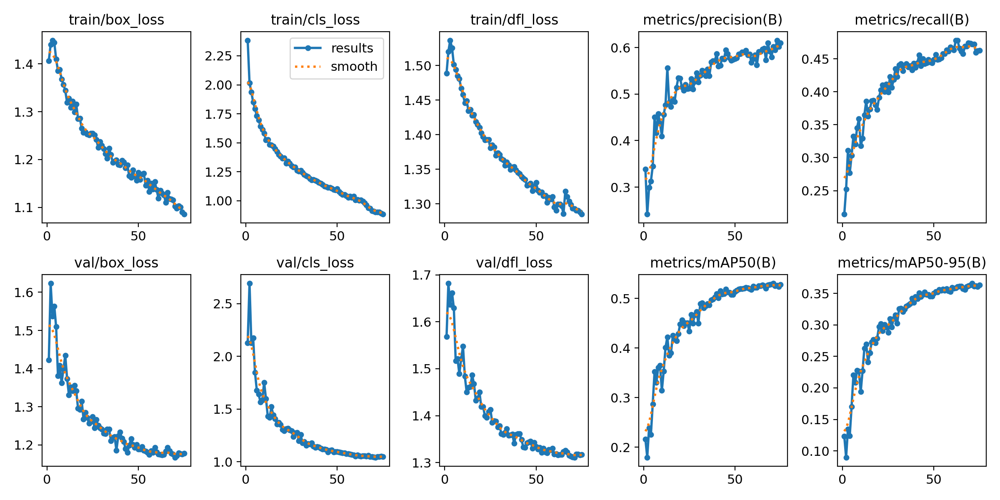
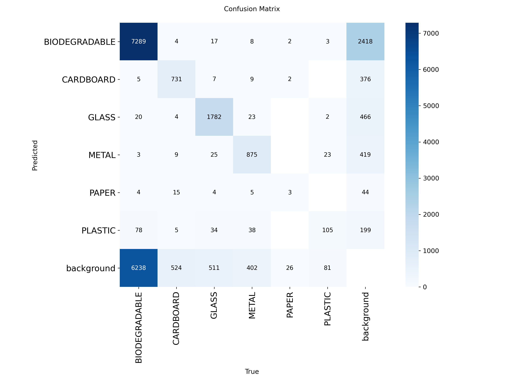

### Week 1: 30% Completion (The "Brain")
* [x] Set up GitHub repository.
* [x] Finalize dataset and project proposal.
* [x] Trained the core YOLOv8 model on the Kaggle dataset (see `notebooks/`).
* [x] Saved the trained model (`model/best.pt`) and validation results.

#### Training Results
* **Model:** YOLOv8-Nano
* **Epochs:** 75
* **mAP50-95:** 0.528 (from `results.png`)

